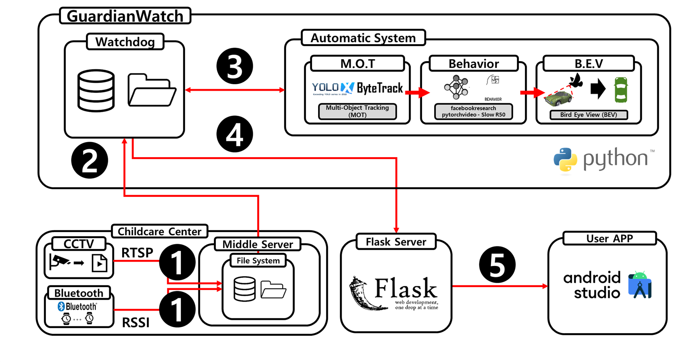
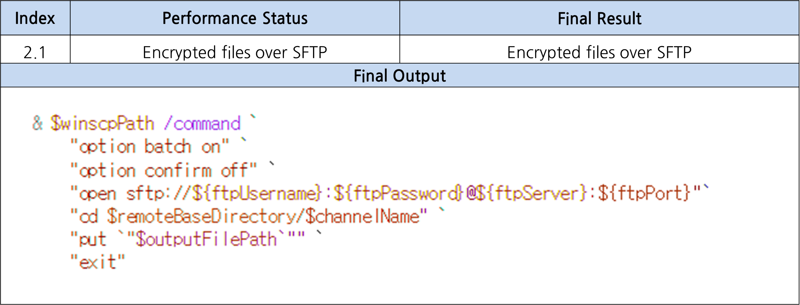
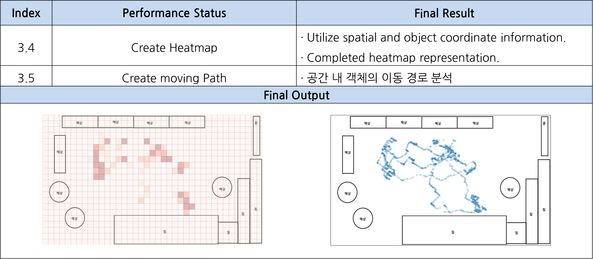

# 2023 Gachon univ. SW senior_project2 '**GuardianWatch**'
# GuardianWatch
### Intelligent Childcare Center Safety Monitoring System Using Multi-Object Tracking Technology

<b>Members</b>

<b> 201935085 유인재   202135588 최지우   201033095 김경민   201935011 김관일 </b>

# [> 수상 <](https://github.com/sts07142/senior_project#5-award)

***
# Index
### 1. Purpose & Necessity[↗️](https://github.com/sts07142/senior_project#1-purpose--necessity)
### 2. Objective & Output[↗️](https://github.com/sts07142/senior_project#2-objective--output)
### 3. Result[↗️](https://github.com/sts07142/senior_project#3-result)
### 4. Expectation[↗️](https://github.com/sts07142/senior_project#4-expectation)
### 5. Award[↗️](https://github.com/sts07142/senior_project#5-award)

 

***

 

<b>Descriptions</b>

# 1. Purpose & Necessity[↑](https://github.com/sts07142/senior_project#index)

## 1-1 #01. Curious of child’s daily life
* ### Lack of communication skills

## 1-1 #02. Increase Abuse in Childcare center
* ### Check CCTV after abuse

## 1-1 #03. Limited CCTV Access
* ### Limited access due to privacy 

## 1-2. Introduction
* ### Intelligent Childcare Center Safety Monitoring System

 

# 2. Objective & Output[↑](https://github.com/sts07142/senior_project#index)
## 2-1. Objective
### System Archiecture

## 2-2. Detailed Objective
### Re-ID problem in M.O.T

## 2-3. Output

# 3. Result[↑](https://github.com/sts07142/senior_project#index)

||||
|:-----------------------:|:--------------------------:|:------------------------:|
|Sign Up/Login            |Register Child              |Set Main Child            |
||   | |
|      Notification       |      Amount of Activity    |      Bird Eye View       |
||   | |

# 4. Expectation[↑](https://github.com/sts07142/senior_project#index)
## 4-1. Expectation

|||
|:--------------------------------------:|:----------------------------------------:|
|Understanding the daily life of my child|Minimization of personal information      |
|        |          |
|Understanding the child                 |Trust between parents and childcare center|
|        |          |

## 4-2. Future Work

|||
|:------------------------------:|:------------------------------:|
|Personal Identification         |Re-ID problem                   |
|||
|Automatic background recognition|Reinforcement Model             |
|||

# 5. Award[↑](https://github.com/sts07142/senior_project#index)

### [은상] [K-디지털 챌린지 : NET 챌린지 캠프 시즌10]

