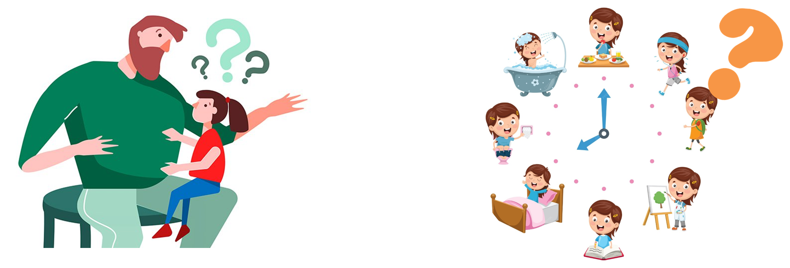
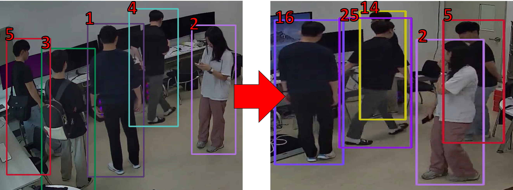
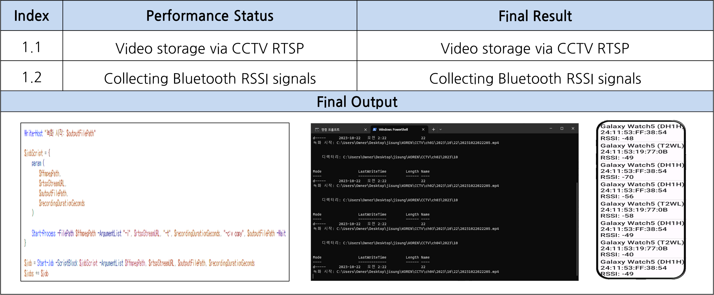
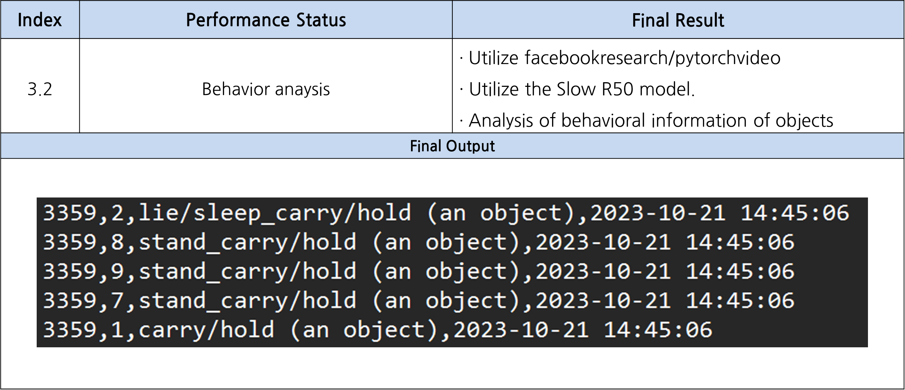

# 2023 Gachon univ. SW senior_project2 '**GuardianWatch**'
# GuardianWatch
### Intelligent Childcare Center Safety Monitoring System 

### Using Multi-Object Tracking Technology

<b>Members</b>

<b> 201935085 유인재   202135588 최지우   201033095 김경민   201935011 김관일 </b>

# 수상

### [은상] [K-디지털 챌린지 : NET 챌린지 캠프 시즌10]

# 시연영상

<!--  -->

<iframe
  class="embed-video youtube"
  loading="lazy"
  src="https://www.youtube.com/embed/SQucFY-N1go"
  title="YouTube video player"
  frameborder="0"
  allow="accelerometer; autoplay; clipboard-write; encrypted-media; gyroscope; picture-in-picture"
  allowfullscreen
></iframe>

***
# - Index
## 1. Purpose & Necessity[⬇️](https://github.com/sts07142/senior_project?tab=readme-ov-file#1-purpose--necessity%EF%B8%8F-1)
## 2. Objective & Output[⬇️](https://github.com/sts07142/senior_project?tab=readme-ov-file#2-objective--output%EF%B8%8F-1)
## 3. Result[⬇️](https://github.com/sts07142/senior_project?tab=readme-ov-file#3-result%EF%B8%8F-1)
## 4. Expectation[⬇️](https://github.com/sts07142/senior_project?tab=readme-ov-file#4-expectation%EF%B8%8F-1)
## 5. Award[⬇️](https://github.com/sts07142/senior_project?tab=readme-ov-file#5-award%EF%B8%8F-1)

 

***
# - Descriptions
 

## 1. Purpose & Necessity[⬆️](https://github.com/sts07142/senior_project?tab=readme-ov-file#--index)

## 1-1 #01. Curious of child’s daily life
* ### Lack of communication skills

## 1-1 #02. Increase Abuse in Childcare center
* ### Check CCTV after abuse

## 1-1 #03. Limited CCTV Access
* ### Limited access due to privacy 

## 1-2. Introduction
* ### Intelligent Childcare Center Safety Monitoring System

 

## 2. Objective & Output[⬆️](https://github.com/sts07142/senior_project?tab=readme-ov-file#--index)

## 2-1. Objective
### System Archiecture

## 2-2. Detailed Objective
### Re-ID problem in M.O.T

## 2-3. Output

## 3. Result[⬆️](https://github.com/sts07142/senior_project?tab=readme-ov-file#--index)

|Sign Up/Login            |Register Child              |Set Main Child            |
|:-----------------------:|:--------------------------:|:------------------------:|
||   | |

|      Notification       |      Amount of Activity    |      Bird Eye View       |
|:-----------------------:|:--------------------------:|:------------------------:|
||   | |

## 4. Expectation[⬆️](https://github.com/sts07142/senior_project?tab=readme-ov-file#--index)

## 4-1. Expectation

|||
|:--------------------------------------:|:----------------------------------------:|
|Understanding the daily life of my child|Minimization of personal information      |
|        |          |
|Understanding the child                 |Trust between parents and childcare center|
|        |          |

## 4-2. Future Work

|||
|:------------------------------:|:------------------------------:|
|Personal Identification         |Re-ID problem                   |
|||
|Automatic background recognition|Reinforcement Model             |
|||

## 5. Award[⬆️](https://github.com/sts07142/senior_project?tab=readme-ov-file#--index)

### [은상] [K-디지털 챌린지 : NET 챌린지 캠프 시즌10]

