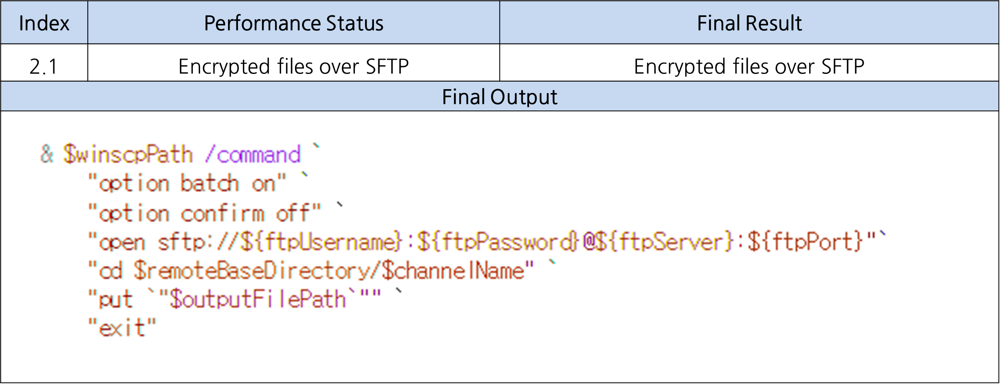
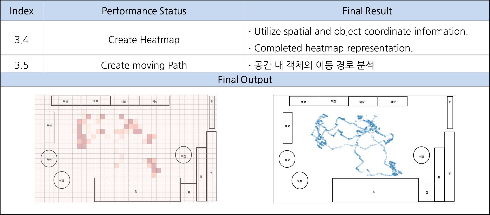
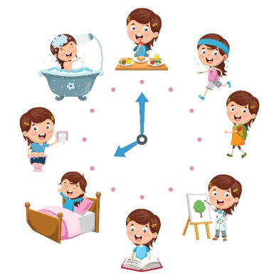

# 2023 Gachon univ. SW senior_project2 '**GuardianWatch**'
# GuardianWatch
* ### Intelligent Childcare Center Safety Monitoring System Using Multi-Object Tracking Technology

> Members 
>> 201935085 유인재    202135588 최지우   201033095 김경민   201935011 김관일

***
# Index
### 1. Purpose & Necessity[↗️](https://github.com/sts07142/senior_project/wiki/GuardianWatch#1-background--motivation-1)
### 2. Objective & Output[↗️](https://github.com/sts07142/senior_project/wiki/GuardianWatch#2-overview-1)
### 3. Result[↗️](https://github.com/sts07142/senior_project/wiki/GuardianWatch#3-system-1)
### 4. Expectation[↗️](https://github.com/sts07142/senior_project/wiki/GuardianWatch#4-plan-1)
### 5. Award[↗️](https://github.com/sts07142/senior_project/wiki/GuardianWatch#5-expectation-1)

 

***

 

# 1. Purpose & Necessity[↑](https://github.com/sts07142/senior_project/wiki/GuardianWatch#Index)

## 1-1 #01. Curious of child’s daily life
* ### Lack of communication skills

## 1-1 #02. Increase Abuse in Childcare center
* ### Check CCTV after abuse

## 1-1 #03. Limited CCTV Access
* ### Limited access due to privacy 

## 1-2. Introduction
* ### Intelligent Childcare Center Safety Monitoring System

 

# 2. Objective & Output[↑](https://github.com/sts07142/senior_project/wiki/GuardianWatch#Index)
## 2-1. Objective
### System Archiecture

## 2-2. Detailed Objective
### Re-ID problem in M.O.T

## 2-3. Output
### Re-ID problem in M.O.T

# 3. Result[↑](https://github.com/sts07142/senior_project/wiki/GuardianWatch#Index)

|  Sign Up/Login  |  Register Child     |  Set Main Child   |
|:---------------:|:-------------------:|:-----------------:|
|      gif        |           gif       |        gif        |

|  Notification   |  Amount of Activity |  Bird Eye View    |
|:---------------:|:-------------------:|:-----------------:|
|      gif        |           gif       |        gif        |

# 4. Expectation[↑](https://github.com/sts07142/senior_project/wiki/GuardianWatch#Index)
## 4-1. Expectation

|Understanding the daily life of my child|Minimization of personal information|
|:--------------------------------------:|:----------------------------------:|
|               |           |

|Understanding the child   |Trust between parents and childcare center|
|:------------------------:|:----------------------------------------:|
| |                 |

## 4-2. Future Work

|Personal Identification  |Re-ID problem            |
|:-----------------------:|:-----------------------:|
|||

|Automatic background recognition|Reinforcement Model     |
|:------------------------------:|:----------------------:|
|      ||

# 5. Award[↑](https://github.com/sts07142/senior_project/wiki/GuardianWatch#Index)

### [은상] [K-디지털 챌린지 : NET 챌린지 캠프 시즌10]

